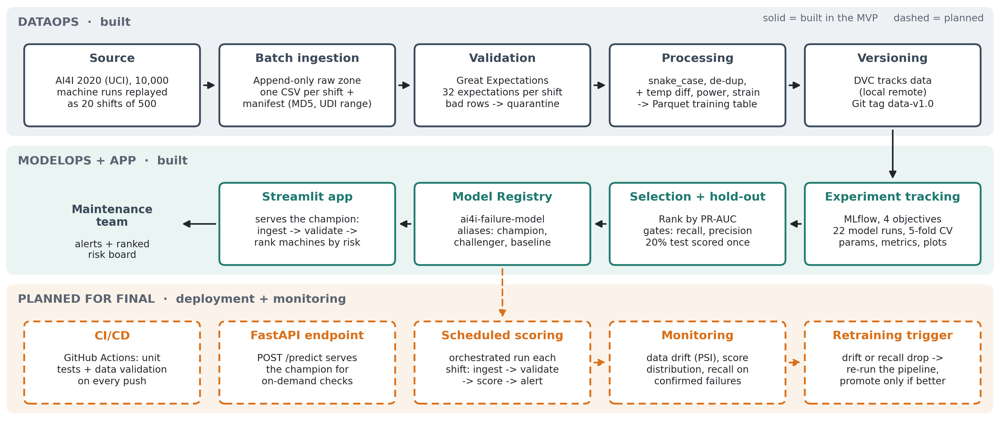

# Machine Failure Early Warning System

A predictive maintenance ML system that flags milling-machine runs at high risk of failure, so maintenance can
fix a machine during a planned stop instead of an emergency in the middle of a job.

Final project for **BANA 7075 - Machine Learning Design for Business**, University of Cincinnati (Lindner College
of Business). Built on the [AI4I 2020 Predictive Maintenance dataset](https://doi.org/10.24432/C5HS5C)
(Matzka, 2020; UCI ML Repository, CC BY 4.0): 10,000 machine runs, 3.4% of which end in failure.



## Why it exists

Unplanned downtime costs the world's 500 largest companies roughly $1.4 trillion a year, about 11% of revenue
(Siemens, *The True Cost of Downtime 2024*). Most plants still run maintenance reactively, after a breakdown, or
on a fixed calendar. This system answers a narrower question every shift: **given a machine's current sensor
readings and tool wear, what is the probability this run ends in failure?** Runs above a cost-based alert
threshold are ranked for the maintenance team.

## Results

Trained on shifts 1-18 (9,000 runs) and scored once on an untouched 20% hold-out set of 1,800 runs:

| Registry version | Model | Alert threshold | CV PR-AUC | Hold-out PR-AUC | Recall | Precision |
|---|---|---|---|---|---|---|
| **v2 · champion** | **Random forest** | **0.29** | **0.883** | **0.923** | **0.90** | **0.84** |
| v3 · challenger | XGBoost | 0.31 | 0.873 | 0.909 | 0.90 | 0.59 |
| v1 · baseline | Logistic regression | 0.96 | 0.444 | 0.476 | 0.29 | 0.62 |

The champion caught **57 of 63 failures with 11 false alarms**. Using the cost assumptions in
`config.yaml` (missed failure $15,000, planned repair $3,000, false alarm $500) that is about **72% lower
expected failure cost** than running with no model at all. Accuracy is deliberately not reported: at a 3.4%
failure rate, always predicting "no failure" scores 96.6%.

## Quick start (macOS)

Double-click the numbered scripts in order from Finder. Each writes a log to `logs/`.

| Script | What it does |
|---|---|
| `1_setup.command` | Creates `~/.venvs/ai4i-failure-warning`, installs `requirements.txt`, downloads the dataset |
| `2_run_pipeline.command` | Ingest shifts 1-18 → validate → process → version with Git + DVC |
| `3_run_experiments.command` | Run every MLflow experiment, then select, hold-out test, and register models |
| `3b_register_models.command` | Re-run only the selection + registry step |
| `4_open_mlflow.command` | MLflow UI at http://127.0.0.1:5050 |
| `5_open_app.command` | Streamlit app at http://localhost:8501 |
| `6_reset_demo.command` | Remove shifts 19-20 and the sensor-glitch file so a demo starts clean |
| `7_push_to_github.command` | Connect the repo to GitHub and push code, `.dvc` pointers, and tags |

Or run it by hand from the project root:

```bash
source ~/.venvs/ai4i-failure-warning/bin/activate

python -m src.ingest --through 18     # land 18 shifts of 500 runs in the append-only raw zone
python -m src.validate                # Great Expectations + row-level quarantine
python -m src.process                 # clean + engineered features -> Parquet training table
python -m src.train                   # all four MLflow objectives (or --objective 1|2|3|4)
python -m src.register                # select, score the hold-out set once, register models

streamlit run app/streamlit_app.py    # the prototype app
mlflow ui --backend-store-uri sqlite:///mlflow.db --port 5050
```

Scoring a batch of machine runs in your own code:

```python
from src.scoring import load_champion, prepare, score

model, info = load_champion()                      # champion alias from the MLflow Model Registry
scored = score(model, prepare(new_runs_df), info["threshold"])
scored[["product_id", "failure_probability", "alert"]].head()
```

## How it works

| Layer | What happens | Tools |
|---|---|---|
| **Ingestion** | The dataset is replayed in order as 20 "shifts" of 500 runs. Each shift lands untouched in an append-only raw zone (`data/raw/`) with a manifest (rows, UDI range, MD5, timestamp). | pandas |
| **Validation** | Every shift runs through 32 Great Expectations checks (schema, nulls, physical ranges, product type, 0/1 labels, unique IDs, process > air temperature, failure-rate and mean bounds). Bad rows go to `data/quarantine/` with the reason attached; reports go to `reports/validation/`. | Great Expectations |
| **Processing** | Validated shifts are combined, renamed, de-duplicated, and enriched with engineered features (temperature difference, mechanical power, strain), then stored as Parquet. | pandas, pyarrow |
| **Versioning** | The source file, raw zone, and training table are tracked with DVC (local remote); code, `.dvc` pointers, and reports live in Git with a `data-v1.x` tag. | Git, DVC |
| **Experiment tracking** | One MLflow experiment, four objectives: model comparison, raw vs engineered features, class-imbalance handling, and a tuning grid as nested runs. Each run logs tags, a description, the dataset, parameters, 5-fold CV metrics, a cost-based threshold, plots, and the model. | MLflow, scikit-learn, XGBoost, imbalanced-learn |
| **Model registry** | The winner is scored once on the hold-out set and registered as `ai4i-failure-model` alongside the best logistic regression (baseline) and the best model from another family (challenger). Aliases: `champion`, `baseline`, `challenger`. | MLflow Model Registry |
| **App** | Streamlit app that serves the `champion` model: ingest the next shift, validate it, and rank machines by failure risk; check a single machine; browse the registry and leaderboard. | Streamlit |

### Model selection rules

1. Rank runs by cross-validated PR-AUC.
2. Gates at each run's threshold: recall ≥ 0.85 and precision ≥ 0.60.
3. Runs within 0.005 PR-AUC: lower expected cost per 1,000 runs wins, then the simpler model.
4. The winner is scored once on the hold-out set and must beat the logistic regression baseline.

Each run's alert threshold is the lowest-expected-cost threshold among those that keep precision ≥ 0.60. It is
stored as a tag on the registered model version, and the app reads it from there.

## Project layout

```
config.yaml            all settings (paths, validation rules, costs, targets, MLflow names)
src/ingest.py          batch ingestion (append-only raw zone + manifest)
src/validate.py        Great Expectations suite + row-level quarantine
src/process.py         training table + engineered features -> Parquet
src/features.py        column names + feature engineering (shared by training and the app)
src/modeling.py        pipelines, cross-validation, cost-based threshold, metrics
src/train.py           MLflow experiments (4 objectives)
src/register.py        selection, hold-out evaluation, Model Registry + aliases
src/scoring.py         load the champion from the registry and score runs
src/simulate.py        sensor-glitch shift for the validation demo, and the demo reset
app/streamlit_app.py   the prototype app
tests/                 pytest suite for the validation rules, features, and metrics
reports/               validation reports, processing summary, leaderboard, model selection
```

## Author

| Name | GitHub | Role |
|---|---|---|
| Ryan Talty | *@your-handle* | Everything: data pipeline, validation, experiment tracking, model registry, Streamlit app, tests |

Solo project for BANA 7075. Issues and pull requests are used for every change, so the history shows how each
piece was planned and reviewed before it landed on `main`.

## Notes and known limits

- The dataset is synthetic and cleaner than real plant data, and it has no timestamps, so the system scores each
  run rather than predicting time to failure.
- XGBoost needs the OpenMP runtime on macOS. The scripts link it to the copy bundled with scikit-learn; if that
  fails, the boosting model falls back to scikit-learn's `HistGradientBoostingClassifier` and says so in the logs.
- Data files live in DVC, not Git. `dvc pull` restores them from the local DVC remote at
  `~/dvc-storage/ai4i-failure-warning`.
- `mlflow.db` and `mlruns/` are the local MLflow store and are not committed.

## Data and license

AI4I 2020 Predictive Maintenance Dataset, S. Matzka, UCI Machine Learning Repository,
[doi.org/10.24432/C5HS5C](https://doi.org/10.24432/C5HS5C), CC BY 4.0. Course project code, for academic use.
